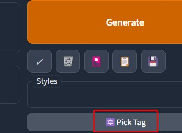
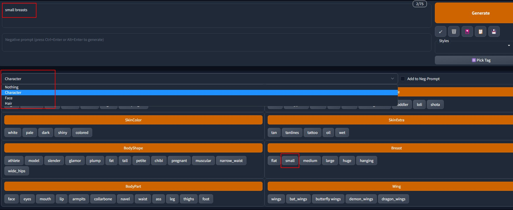
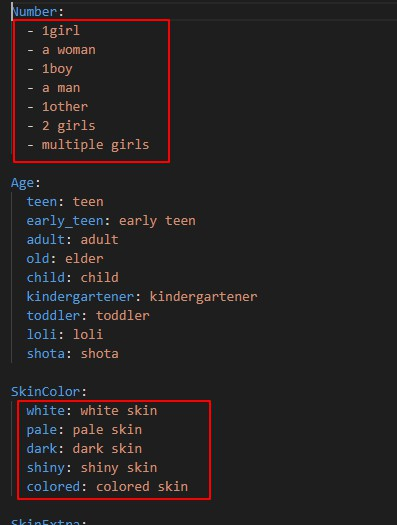

# Easy Prompt Selector
Stable Diffusion Webui Extension Easy Prompt Selector.

Fork to translate this sd webui extension from Janpanese to English  

[How to use](https://blue-pen5805.fanbox.cc/posts/5306601)  

After Installed and reloaded SD Webui, click "Pick Tag" button  
  

 It will open tag area  
  

As you can see, it has 3 build-in templates, as examples. Click a tag, it will be added to prompt.  

Tag name and value can be different.   

Those tag templates are saved as `.yml` files in extension's folder.  
  

Format is simple, each tag line is just key and value. If key is the same as value, you can skip it as screenshot shows.  

# Tag Folder
Normally, your own tag files should put in `tags` folder. If there is no `.yml` file in tags folder, extension will copy build-in example templates into `tags` folder.  

# Wildcard
In above screenshot, there are category buttons with orange color. Click one of these button, it will add wildcard to prompt. Which will pick 1 tag from this category randomly when generating.  

# Right Click To Remove Tag
You can right click a tag to remove it.  

# Works both on gradio 3.23.0 and 3.16.2
There is version checking in it, works for both version of gradio.  

# New Features in this Fork
## "neg-" prefix
In this fork, I add a feature as "If a tag is start with `neg-`, then put this tag into negative prompt, and remove this `neg-` prefix. ". So you don't need to check "Add tag to Neg Prompt"  manually.  
For example, for tag value "neg-child loli", it will be put into negative prompt as "child loli".  

## Click again to remove tag
Click a tag again, it will search this tag in prompt and remove it. Works on prompt, neg-prompt and "neg-" prefixed tag.  

Yes, there is already a right click to remove tag function. But you can not do right clicking on touch screen. So, this one is still needed.  

## BUg fixing
* Tell python side after editing prompt, otherwise python won't know it.  
* Change `Script` function parameter from `Script` to `scripts.Script`, which has a name conflict issue hiding there.  

# Tip
* Tag value doesn't need to be just 1 or 2 words. You can set a whole prompt to 1 tag, then use this tag as a template.  

# FYI
Credit goes to this extension's creator, who don't want to translate this good extension into English. So, I have to fork it to do this.   

No feature request will be accepted, since it is a fork.  
